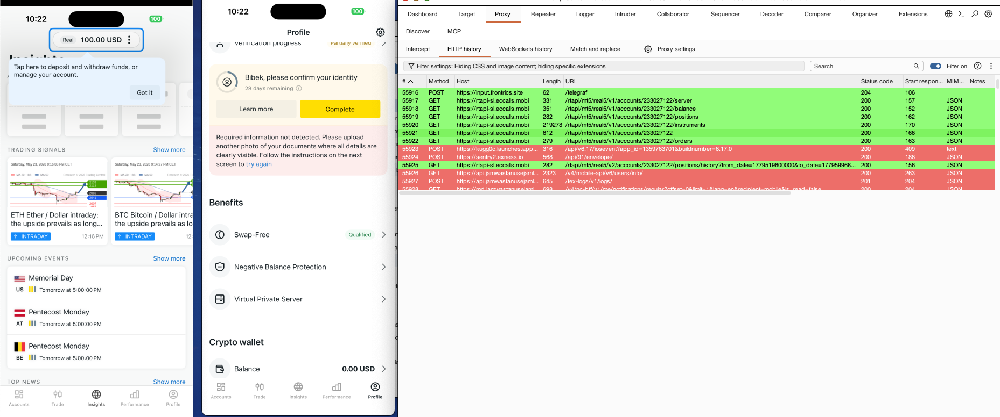

# Port Highlighter + AI Access Control Tester

Burp Suite extension that does two things:

1. **Highlights Proxy History by listener port** — color-code traffic from different devices (like PwnFox, but port-based)
2. **AI-powered access control testing** — captures sessions per port, cross-replays requests across roles, and uses AI to detect IDOR / privilege escalation



## How Access Control Testing Works

```
Device A (admin) → proxy :8082  →  request captured + session stored
                                     ↓
                              replay with user session from :8083
                                     ↓
                              compare responses
                                     ↓
                              AI analyzes differences → reports vulnerability
```

1. **Session tracking** — cookies + auth headers are stored per port
2. **Cross-replay** — when an admin request comes in, it's automatically replayed using a user session from another port
3. **Response comparison** — if the user gets the same data as admin, it's flagged
4. **AI analysis** — flagged findings are sent to an LLM (OpenAI/OpenRouter) that determines if it's a real vulnerability
5. **Reporting** — vulnerabilities are output to Burp's Extender tab

## Configuration

Edit `port_highlighter.py`:

```python
ROLE_MAPPINGS = {
    8082: {"color": "red",    "role": "admin"},
    8083: {"color": "green",  "role": "user"},
}

AI_API_KEY = "sk-..."                         # Or set via OPENAI_API_KEY env var
AI_BASE_URL = "https://api.openai.com/v1/chat/completions"
AI_MODEL = "gpt-4o-mini"

AUTO_TEST = True   # Set False to only test on right-click
```

## Installation

```bash
brew install jython
```

In Burp: **Extender → Extensions → Add** → Type: **Python** → Select `port_highlighter.py`

## Usage

**Automatic mode:** Browse normally on both devices. The extension continuously cross-tests admin requests against user sessions and reports via AI.

**Manual mode:** Right-click any request in Proxy History → **Test Access Control (AI)**.

## Provider Options

Works with any OpenAI-compatible API:

| Provider    | AI_BASE_URL                                       |
|-------------|---------------------------------------------------|
| OpenAI      | `https://api.openai.com/v1/chat/completions`      |
| OpenRouter  | `https://openrouter.ai/api/v1/chat/completions`   |
| Ollama      | `http://localhost:11434/v1/chat/completions`      |

## License

MIT
